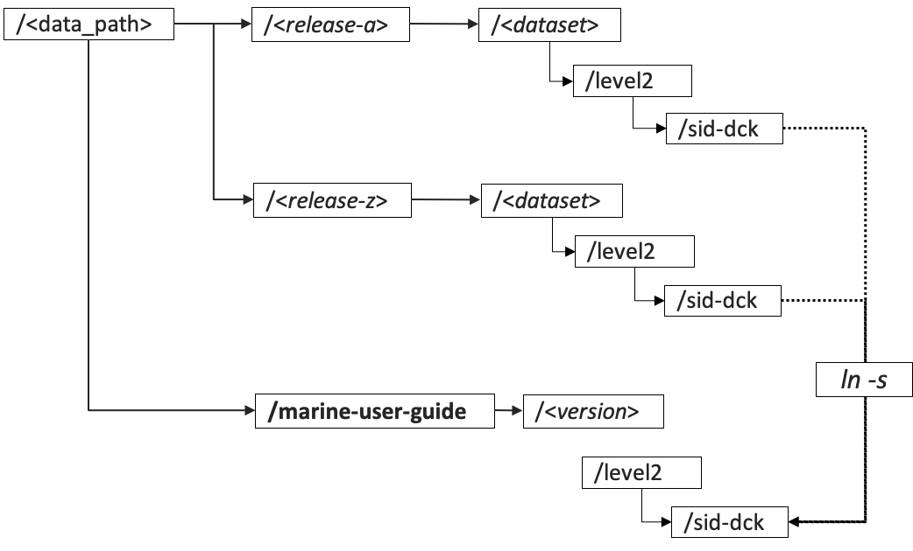

.. Marine user manual documentation master file, created by
   sphinx-quickstart on Mon Jun 22 22:10:11 2020.
   You can adapt this file completely to your liking, but it should at least
   contain the root `toctree` directive.

Welcome to Marine user guide's documentation!
==============================================

.. toctree::
   :maxdepth: 3
   :caption: Contents:

Indices and tables
==================

* :ref:`genindex`
* :ref:`modindex`
* :ref:`search`

Introduction
============

This project contains the necessary code to produce the data summaries that are
included in the Marine User Guide. These help document the status of the marine
in situ data in the CDS after every new data release. The marine data available
in the CDS is the result of a series of data releases that are stored in the
marine data file system in different directories. This project uses the data in
the marine file system, rather than accessing the CDS data.

Additionally, the tools employed to create the individual source deck reports
are also available in this project. These can be created for a single data
release or for the combination of releases included in a Marine User Guide
version.

This manual has two main independent sections dedicated to the Marine User Guide
and to the individual source deck reports:

* :ref:`marine_user_guide`
* :ref:`source_deck_reports`

Every new data release can potentially be created with a different version of
the marine processing software. The current version of this project is
compatible with the glamod-marine-processing code up to version v1.1 the HEAD
of the repository as of August 2020.

The configuration files needed to run this project are maintained in a separate
git repository (https://git.noc.ac.uk/iregon/glamod-marine-config.git), within
this repository.

Tool set-up
===========

Code set up
-----------

The repository was tagged to v1.1 after C3S data release_2.0 and Marine User
Guide v4. However changes were added to the project following the job scheduler
change in CEDA-JASMIN. These changes have not been tagged yet, to clone the
latest available:

.. code-block:: bash

  git clone git@git.noc.ac.uk:iregon/marine-user-guide.git

Build the python environment using the requirements.txt file in
marine-user-guide/env. This step system dependent. The following code block
described the steps to follow in CEDA JASMIN, using the Jaspy toolkit.

.. code-block:: bash

  cd marine-user-guide/env
  module load jaspy/3.7
  virtualenv -–system-site-packages mug_env
  source mug_env/bin/activate
  pip install -r requirements.txt

Data directory setup
--------------------

The data the tools in this project use and the products created are stored
in the marine-user-guide data directory [#fDDS]_. This directory does not contain
the actual data files, but links to the files in the data releases' directories. This
approach greatly simplifies the configuration of the different scripts and is followed
even if a given Marine User Guide version is made up of a single data release.

The marine-user-guide data directory is then split in directories to host
subsequent versions of the Marine User Guide.

.. figure:: ../pics/in_data_space.pdf
  :width: 150
  :align: center

This general directory needs to be created before starting using the tool.

.. code-block:: bash

  cd <parent_data_directory>
  mkdir marine-user-guide

.. rubric:: Footnotes

.. [#fDDS] When producing data summaries and figures of individual source-decks \
  of a single release, the data is accessed directly from the release data
  directory.

Paths setup
-----------

Edit file marine-user-guide/setpaths.sh and modify as needed the following fields:

* code_directory: parent path of the repository installation.
* data_directory: parent path to the data release directories.
* mug_code_directory: marine user guide code directory installation.
* mug_data_directory: marine user guide data directory path.

.. _marine_user_guide:

Marine User Guide
=================

Every C3S Marine User Guide version includes a series of figures that describe
the marine in situ data holdings in the CDS. The following sections explain how
these figures are created for every new version of the Marine User Guide.

.. _init_mug:

Initializing a new user guide
-----------------------------

Every new version of the Marine User Guide (MUG) needs to be initialised in the
tools' data directory as shown in the figure.

.. _file_links:

  Marine User Guide data directory and its relation to the individual data \
  releases' directories.

These steps initialize a new version:

1. Create the data configuration file (*mug_file*, :ref:`mug_config`) by merging \
the level2 configuration files of the different data releases \
included in the new version ( :ref:`level2`).

  .. code-block:: bash

    source marine-user-guide/setpaths.sh
    source marine-user-guide/setenv.sh
    python marine-user-guide/init_version/init_config.py

2. Use the sid-dck keys of the *mug_config* file to create a simple ascii file \
with the full list of source-deck IDs of the release merge (*mug_list*).

3. Create the directory tree for the version in the  in the marine-user-guide \
data directory.

  .. code-block:: bash

    source marine-user-guide/setpaths.sh
    source marine-user-guide/setenv.sh
    python /marine-user-guide/init_version/create_version_dir_tree.py mug_path version mug_config

  where:

  * mug_path: full path to the marine-user-guide data directory
  * version: tag to use for Marine User Guide version
  * mug_config: path to *mug_config* file

4. Populate it with a view of the merged data releases: rather than copying all \
the files, this is done by linking the corresponding files from the releases' \
directories to the marine-user-guide data directory. Data linked is the level2 \
data files and level1a and level1c quicklook json files.

A launcher bash script configures a SLURM job for each *sid-dck* data partition
and logs to level2/log/*sid-dck*/merge_release_data.*ext*, with *ext* being *ok* or
*failed* depending on job termination status.

  .. code-block:: bash

    ./marine-user-guide/init_version/merge_release_data.slurm version mug_config mug_list

  where:

  * version: tag to use for Marine User Guide version
  * mug_config: path to *mug_config* file
  * mug_list: path to *mug_list* file.

5. Check that the copies really reflect the merge of the releases. \
Edit the following script to add the corresponding paths and run. If any does \
not match, it will prompt an error.

.. code-block:: bash

  ./marine-user-guide/init_version/merge_release_data_check.sh

Data summaries
--------------

The data summaries are monthly aggregations over all the source-deck ID partitions
in the data. These aggregations are on the data counts and observation values
and on some relevant quality indicators and are the basis to then create the
time series plots and maps included in the MUG.

.. _monthly_grids_um_section:

Monthly grids
^^^^^^^^^^^^^

Aggregations in monthly lat-lon grids. The CDM table determines what
aggregations are applied:

  * header table: number of reports per grid cell per month.
  * observations tables: number of observations and mean observed_value per grid \
    cell per month.

Each aggregation is stored in an individual netcdf file.

All the aggregations are configured in a common configuration file,
monthly_grids.json ( :ref:`mon_grids_um`). The current configuration for the MUG
excludes reports not passing all the quality checks. The same tool can be used
to produce data summaries with different filter criteria, but modifying the
filter values in the configuration file.

A launcher bash script configures a SLURM job for each CDM table and logs
to level2/log/*sid-dck*/*config_file*-*table*.*ext*, with *ext* being *ok* or
*failed* depending on job termination status.

.. code-block:: bash

   ./marine-user-guide/data_summaries/monthly_grids.slurm version monthly_grids.json

where:

* version: tag to use for Marine User Guide version
* config_file: path to the monthly grids configuration file

.. _qi_counts_um_section:

Monthly time series of selected quality indicators
^^^^^^^^^^^^^^^^^^^^^^^^^^^^^^^^^^^^^^^^^^^^^^^^^^

Monthly time series of quality indicators' value counts aggregated over all the
source-deck partitions. These are additionally, split in counts by main
platform types (ships and buoys) and include the total number of reports. They
are stored in ascii pipe separated files.

The configuration file monthly_qi.json ( :ref:`qi_counts_um`), includes very
limited parameterization, basically the data paths. The python script only works
on the CDM header table quality indicators.

A launcher bash script configures a SLURM job for each quality indicator
summarized (currently only report_quality and duplicate_status) and logs to
level2/log/*sid-dck*/*config_file*-*qi*.*ext*, with *ext* being *ok* or
*failed* depending on job termination status.

.. code-block:: bash

  ./marine-user-guide/data_summaries/monthly_qi.slurm version config_file

where:

* version: tag to use for Marine User Guide version
* config_file: path to the monthly grids configuration file

Figures
-------

The data summaries generated are used to create the maps and time series plots
included in the Marine User Guide. The following sections give the necessary
directives to create them, with references to the configuration files used.

Number of reports time series plot
^^^^^^^^^^^^^^^^^^^^^^^^^^^^^^^^^^

* Data summary used: :ref:`qi_counts_um_section` (report_quality counts file: \
  total number of reports field only)
* Configuration file: nreports_ts_plot.json ( :ref:`nreports_ts_config`)
* Command:

  .. code-block:: bash

    source /marine-user-guide/setpaths.sh
    source /marine-user-guide/setenv.sh
    python /marine-user-guide/figures/nreports_ts_plot.py nreports_ts_plot.json

Duplicate status time series plot
^^^^^^^^^^^^^^^^^^^^^^^^^^^^^^^^^

    * Data summary used: :ref:`qi_counts_um_section` (duplicate_status file)
    * Configuration file: duplicate_status_ts_plot.json (:ref:`nreports_dup_ts_config`)
    * Command:

      .. code-block:: bash

        source /marine-user-guide/setpaths.sh
        source /marine-user-guide/setenv.sh
        python /marine-user-guide/figures/duplicate_status_ts_plot.py duplicate_status_ts_plot.json

Report quality time series plot
^^^^^^^^^^^^^^^^^^^^^^^^^^^^^^^

    * Data summary used: :ref:`qi_counts_um_section` (report_quality file)
    * Configuration file: report_quality_ts_plot.json (:ref:`nreports_qc_ts_config`)
    * Command:

      .. code-block:: bash

        source /marine-user-guide/setpaths.sh
        source /marine-user-guide/setenv.sh
        python /marine-user-guide/figures/report_quality_ts_plot.py report_quality_ts_plot.json

Number of reports Hovmöller plots
^^^^^^^^^^^^^^^^^^^^^^^^^^^^^^^^^

    * Data summary used: :ref:`monthly_grids_um_section` (report counts files: header and observation tables)
    * Configuration file: nreports_hovmoller_plot.json (:ref:`nreports_hovmoller_config`)
    * Command:

      .. code-block:: bash

        source /marine-user-guide/setpaths.sh
        source /marine-user-guide/setenv.sh
        python /marine-user-guide/figures/nreports_hovmoller_plot.py nreports_hovmoller_plot.json

ECV coverage time series plot grid
^^^^^^^^^^^^^^^^^^^^^^^^^^^^^^^^^^

    * Data summary used: :ref:`monthly_grids_um_section` (report counts files: header and observation tables)
    * Configuration file: ecv_coverage_ts_plot_grid.json (:ref:`ecv_coverage_config`)
    * Command:

      .. code-block:: bash

        source /marine-user-guide/setpaths.sh
        source /marine-user-guide/setenv.sh
        python /marine-user-guide/figures/ecv_coverage_ts_plot_grid.py ecv_coverage_ts_plot_grid.json

Number of reports and number of months maps
^^^^^^^^^^^^^^^^^^^^^^^^^^^^^^^^^^^^^^^^^^^

  * Data summary used: :ref:`monthly_grids_um_section` (report counts files: header and observation tables)
  * Configuration file: nreports_and_nmonths_maps.json (:ref:`nreports_nmonths_map`)
  * Command:

    .. code-block:: bash

      source /marine-user-guide/setpaths.sh
      source /marine-user-guide/setenv.sh
      python /marine-user-guide/figures/nreports_and_nmonths_maps.py nreports_and_nmonths_maps.json

Mean observed value maps
^^^^^^^^^^^^^^^^^^^^^^^^

  * Data summary used: :ref:`monthly_grids_um_section` (mean files: observation tables)
  * Configuration file: mean_observed_value_maps.json (:ref:`map_mean_config`)
  * Command:

    .. code-block:: bash

      source /marine-user-guide/setpaths.sh
      source /marine-user-guide/setenv.sh
      python /marine-user-guide/figures/mean_observed_value_maps.py mean_observed_value_maps.json

.. _source_deck_reports:

Individual source-deck reports
==============================

First see :ref:`appendix_sd` for configuration file and options.

The source_deck_list is a simple ascii file with the list of source ID - deck ID
pairs to process by the launcher script.

Reports on a release merge
--------------------------

To create the individual source-deck reports on a merge of data releases, steps
in :ref:`init_mug` first need to be followed, so that the input data and
required directory structure is ready in the marine-user-guide data directory.

Data data summaries
-------------------

The data summaries are monthly aggregations of report counts, observation values
and additional CDM fields of the individual source-deck's table files.

.. _monthly_grids_sd_section:

Monthly grids
^^^^^^^^^^^^^

Aggregations in monthly lat-lon grids. The CDM table determines what
aggregations are applied:

  * header table: number of reports per grid cell per month.
  * observations tables: number of observations and mean, max and min
    observed_value per grid cell per month.

Each aggregation is stored in an individual netcdf file.

All the aggregations are configured in a common configuration file. There are
currently two configurations that need to be run to create the data summaries
needed: one using the full dataset and another one using the optimal dataset
(all quality control checks passed).

A launcher bash script configures a SLURM job for each *sid-dck* data partition
and each table and logs to *log_dir*/*sid-dck*/*config_file*-*table*.*ext*, with
*ext* being *ok* or *failed* depending on job termination status.

.. code-block:: bash

   ./marine-user-guide/data_summaries_sd/monthly_grids_sd.slurm log_dir config_file source_deck_list

where:

  * log_dir: the logging directory is assumed to be split in the source-deck data
    partitions. It is normally */level[1e|2]/log* in the directory where the data is.
    It needs to be input to the launcher as this script can be run either on the
    individual release directories or on the marine-user-guide data directories.
  * config_file:

    * Full dataset: monthly_grids_sd_all.json (:ref:`monthly_grids_sd_all`)
    * Optimal dataset: monthly_grids_sd_optimal.json (:ref:`monthly_grids_sd_optimal`)

  * source_deck_list: ascii file with a list of the *sid-dck* partitions to process

.. _qi_counts_sd_section:

Monthly time series of selected quality indicators
^^^^^^^^^^^^^^^^^^^^^^^^^^^^^^^^^^^^^^^^^^^^^^^^^^

Monthly time series of quality indicators' value counts for every *sid-dck* data
partition. These are additionally, split in counts by main platform types (ships
and buoys) and include the total number of reports. They are stored in ascii
pipe separated files.

The configuration file monthly_qi_sd.json ( :ref:`qi_counts_sd`), includes very
limited parameterization, basically the data paths. The python script only works
on the CDM header table quality indicators.

A launcher bash script configures a SLURM job for each *sid-dck* data partition
and each quality indicator (currently only report_quality and duplicate_status)
and logs to *log_dir*/*sid-dck*/*config_file*-*qi*.*ext*, with *ext* being *ok*
or *failed* depending on job termination status.

.. code-block:: bash

   ./marine-user-guide/data_summaries_sd/monthly_qi_sd.slurm log_dir monthly_qi_sd.json source_deck_list

where:

  * log_dir: the logging directory is assumed to be split in the source-deck data
    partitions. It is normally */level[1e|2]/log* in the directory where the data is.
    It needs to be input to the launcher as this script can be run either on the
    individual release directories or on the marine-user-guide data directories.
  * source_deck_list: ascii file with a list of the *sid-dck* partitions to process

.. _report_io_sd_section:

Monthly time series with source to C3S IO flow
^^^^^^^^^^^^^^^^^^^^^^^^^^^^^^^^^^^^^^^^^^^^^^

Collection of monthly time series that describe the main report IO flow, from
the initial reports in the source dataset to those finally delivered to C3S for
every *sid-dck* data partition.

A launcher bash script configures a SLURM job for each *sid-dck* data partition
and logs to *log_dir*/*sid-dck*/*config_file*.*ext*, with *ext* being *ok* or
*failed* depending on job termination status.

.. code-block:: bash

  ./marine-user-guide/data_summaries_sd/report_io_sd.slurm log_dir report_io_sd.json source_deck_list

where:

* log_dir: the logging directory is assumed to be split in the source-deck data
  partitions. It is normally */level[1e|2]/log* in the directory where the data is.
  It needs to be input to the launcher as this script can be run either on the
  individual release directories or on the marine-user-guide data directories.
* report_io_sd.json: :ref:`report_io_sd`
* source_deck_list: ascii file with a list of the *sid-dck* partitions to process

Figures
-------

ECV reports time series plots
^^^^^^^^^^^^^^^^^^^^^^^^^^^^^

    * Data summary used: :ref:`monthly_grids_sd_section` (counts, header and observation tables)
    * Launcher script: configures a SLURM job for each *sid-dck* data partition \
      and logs to *log_dir*/*sid-dck/*config_file*.*ext*, with *ext* being *ok* \
      or *failed* depending on job termination status.

      .. code-block:: bash

        ./marine-user-guide/figures_sd/ecv_reports_ts_plot_grid_sd.slurm log_dir config_file source_deck_list

      where:

      * log_dir: the logging directory is assumed to be split in the source-deck data
        partitions. It is normally */level[1e|2]/log* in the directory where the data is.
        It needs to be input to the launcher as this script can be run either on the
        individual release directories or on the marine-user-guide data directories.
      * config_file: ecv_reports_ts_plot_grid_sd-all.json ( :ref:`ecv_noreports_config_sd_all`), \
        ecv_reports_ts_plot_grid_sd-optimal.json  ( :ref:`ecv_noreports_config_sd_optimal` )
      * source_deck_list: ascii file with a list of the *sid-dck* partitions to process

Observed parameters latitudinal time series
^^^^^^^^^^^^^^^^^^^^^^^^^^^^^^^^^^^^^^^^^^^

    * Data summary used: monthly grids (counts, min, max, counts from observation tables). \
      All data and optimal dataset summaries.
    * Launcher script: configures a SLURM job for each *sid-dck* data partition \
      and each *mode* (all data and optimal dataset) logs to *log_dir*/*sid-dck/*config_file*-*mode*.*ext*, with *ext* being *ok* \
      or *failed* depending on job termination status.

      .. code-block:: bash

        ./marine-user-guide/figures_sd/param_lat_bands_ts.slurm log_dir config_file source_deck_list

      where:

      * log_dir: is created by the launcher script if does not exist
      * config_file: :ref:`param_lat_bands_ts`
      * source_deck_list: ascii file with a list of the *sid-dck* partitions to process

Duplicate status time series plot
^^^^^^^^^^^^^^^^^^^^^^^^^^^^^^^^^

* Data summary used: duplicate_status quality indicators time series.
* Command:

  .. code-block:: bash

    ./marine-user-guide/figures_sd/nreports_dup_ts_sd.slurm log_dir config_file source_deck_list

  where:

  * log_dir: is created by the launcher script if does not exist
  * config_file: :ref:`nreports_dup_ts_sd`
  * source_deck_list: ascii file with a list of the *sid-dck* partitions to process

Report quality time series plot
^^^^^^^^^^^^^^^^^^^^^^^^^^^^^^^

* Data summary used: report_quality quality indicators time series.
* Command:

.. code-block:: bash

  ./marine-user-guide/figures_sd/nreports_qc_ts_sd.slurm log_dir config_file source_deck_list

where:

* log_dir: is created by the launcher script if does not exist
* config_file: :ref:`nreports_qc_ts_sd`
* source_deck_list: ascii file with a list of the *sid-dck* partitions to process

Monthly time series with source to C3S IO flow
^^^^^^^^^^^^^^^^^^^^^^^^^^^^^^^^^^^^^^^^^^^^^^

* Data summary used: monthly time series with IO flow
* Command:

  .. code-block:: bash

    ./marine-user-guide/figures_sd/report_io_sd.slurm log_dir config_file source_deck_list

where:

* log_dir: is created by the launcher script if does not exist
* config_file: :ref:`report_io_plot_sd`
* source_deck_list: ascii file with a list of the *sid-dck* partitions to process

.. _appendix:

Appendix 1. Marine User Guide configuration files
=================================================

The configuration files needed to run this project are maintained in a separate
git repository (https://git.noc.ac.uk/iregon/glamod-marine-config.git). Every
Marine User Guide version has a dedicated directory within this repository. This
appendix provides the files (or an extract of them) used to run the fourth
version of the Marine User Guide.

.. _level2:

level2 file format
------------------

.. literalinclude:: ../config_files/release_20_level2.json
  :caption: Release_2.0 level2 file extract

.. literalinclude:: ../config_files/r092019_level2.json
  :caption: r092019 level2 file extract

.. _mug_config:

Marine user guide data configuration file
-----------------------------------------

.. literalinclude:: ../config_files/mug_v4_config.json
  :caption: Marine User Guide v4 configuration file extract

.. _mon_grids_um:

Monthly grids
-------------

.. literalinclude:: ../config_files/monthly_grids.json

.. _qi_counts_um:

Quality indicators time series
------------------------------

.. literalinclude:: ../config_files/monthly_qi.json

.. _nreports_ts_config:

Number of reports time series plot
----------------------------------

.. literalinclude:: ../config_files/nreports_ts_plot.json

.. _nreports_dup_ts_config:

Duplicate status time series plot
---------------------------------

.. literalinclude:: ../config_files/duplicate_status_ts_plot.json

.. _nreports_qc_ts_config:

Report quality time series plot
-------------------------------

.. literalinclude:: ../config_files/report_quality_ts_plot.json

.. _nreports_hovmoller_config:

Number of reports Hovmöller plots
---------------------------------

.. literalinclude:: ../config_files/nreports_hovmoller_plot.json

.. _ecv_coverage_config:

ECV coverage time series plot grid
----------------------------------

.. literalinclude:: ../config_files/ecv_coverage_ts_plot_grid.json

.. _nreports_nmonths_map:

Number of reports and number of months maps
-------------------------------------------

.. literalinclude:: ../config_files/nreports_and_nmonths_maps.json

.. _map_mean_config:

Mean observed value maps
------------------------

.. literalinclude:: ../config_files/mean_observed_value_maps.json

.. _appendix_sd:

Appendix 2. Individual source-deck reports configuration files
==============================================================

The scripts for the individual source-deck reports can run both on a data release
directory or on a release merge under the marine-user-guide data directory.

For individual data releases the following will apply for file paths in
the configuration files:

* *dir_data*: <marine_data_directory>/*release*/*dataset*/level[1e|2]
* *dir_out*:  <marine_data_directory>/*release*/*dataset*/level[1e|2]/reports

with corresponding main paths for other input data required.

For release merges the following will apply for file paths in
the configuration files:

* *dir_data*: <marine_data_directory>/marine-user-guide/*version*/level2
* *dir_out*:  <marine_data_directory>/marine-user-guide/*version*/level2/reports

with corresponding main paths for other input data required.

The sample files provided can be found in the /marine-user-guide/release_demo
directory of the configuration repository. They correspond to reports on the
level1e data of an individual data release.

.. _monthly_grids_sd_all:

Monthly grids (full dataset)
----------------------------

.. literalinclude:: ../config_files_sd/monthly_grids_sd_all.json

.. _monthly_grids_sd_optimal:

Monthly grids (optimal dataset)
-------------------------------

.. literalinclude:: ../config_files_sd/monthly_grids_sd_optimal.json

.. _qi_counts_sd:

qi_counts
---------

.. literalinclude:: ../config_files_sd/monthly_qi_sd.json

.. _report_io_sd:

Monthly time series with source to C3S IO flow
----------------------------------------------

.. literalinclude:: ../config_files_sd/report_io_sd.json

.. _ecv_noreports_config_sd_all:

ECV reports time series plots (all data)
----------------------------------------

.. literalinclude:: ../config_files_sd/ecv_reports_ts_plot_grid_sd-all.json

.. _ecv_noreports_config_sd_optimal:

ECV reports time series plots (optimal dataset)
-----------------------------------------------

.. literalinclude:: ../config_files_sd/ecv_reports_ts_plot_grid_sd-optimal.json

.. _param_lat_bands_ts:

Observed parameters latitudinal time series plot
------------------------------------------------

.. literalinclude:: ../config_files_sd/param_lat_bands_ts.json

.. _nreports_dup_ts_sd:

Duplicate status time series plot
---------------------------------

.. literalinclude:: ../config_files_sd/nreports_dup_ts_sd.json

.. _nreports_qc_ts_sd:

Report quality time series plot
-------------------------------

.. literalinclude:: ../config_files_sd/nreports_qc_ts_sd.json

.. _report_io_plot_sd:

Data IO flow plot
-----------------

.. literalinclude:: ../config_files_sd/report_io_plot.json
